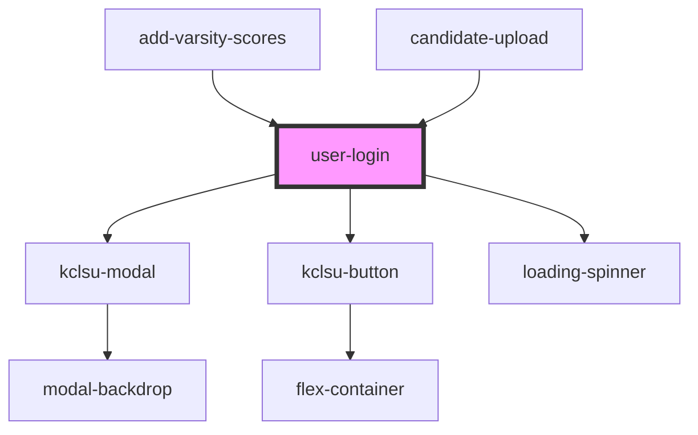

# user-login

<!-- Auto Generated Below -->

## Properties

| Property                | Attribute      | Description                                          | Type                      | Default     |
| ----------------------- | -------------- | ---------------------------------------------------- | ------------------------- | ----------- |
| `callbackFn`            | --             | Provide a custom callback.                           | `(token: string) => void` | `undefined` |
| `database` _(required)_ | `database`     | The name of the database area. For example: projectx | `string`                  | `undefined` |
| `unsignedauth`          | `unsignedauth` |                                                      | `boolean`                 | `undefined` |

## Dependencies

### Used by

 - [add-varsity-scores](../../projects/varsity/add-varsity-scores)
 - [candidate-upload](../../projects/elections/candidate_upload)

### Depends on

- [kclsu-modal](../../modal)
- [kclsu-button](../../buttons/kclsu-button)
- [loading-spinner](../../spinner)

### Graph

----------------------------------------------

*Built with [StencilJS](https://stenciljs.com/)*
