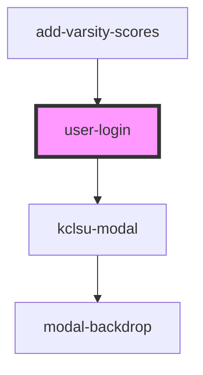

# user-login

<!-- Auto Generated Below -->

## Properties

| Property   | Attribute  | Description                                          | Type     | Default     |
| ---------- | ---------- | ---------------------------------------------------- | -------- | ----------- |
| `database` | `database` | The name of the database area. For example: projectx | `string` | `undefined` |

## Dependencies

### Used by

 - [add-varsity-scores](../../varsity/add-varsity-scores)

### Depends on

- [kclsu-modal](../../modal)

### Graph

----------------------------------------------

*Built with [StencilJS](https://stenciljs.com/)*
