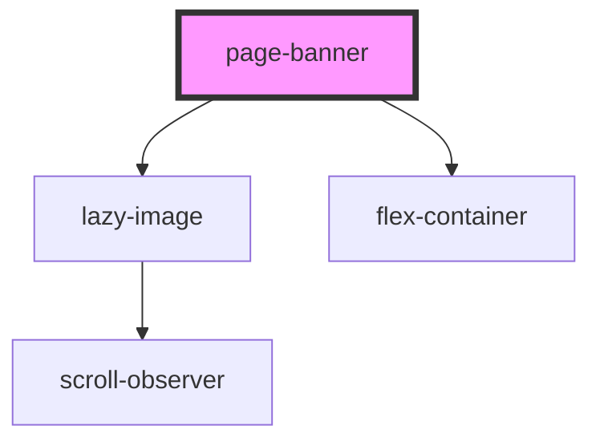

# page-banner

<!-- Auto Generated Below -->

## Properties

| Property           | Attribute          | Description                                                                                                           | Type      | Default            |
| ------------------ | ------------------ | --------------------------------------------------------------------------------------------------------------------- | --------- | ------------------ |
| `bgimage`          | `bgimage`          | Supply a background image for the banner                                                                              | `string`  | `undefined`        |
| `colourscheme`     | `colourscheme`     | The colours for the background & text of <project-heading>, separated with a comma. eg "text colour, bg colour"       | `string`  | `"white, #502669"` |
| `heading`          | `heading`          | The <h2> heading for the section                                                                                      | `string`  | `undefined`        |
| `image`            | `image`            | Supply an image for the banner                                                                                        | `string`  | `undefined`        |
| `imageheight`      | `imageheight`      | Supply a custom height for the banner image                                                                           | `string`  | `'678'`            |
| `imagewidth`       | `imagewidth`       | Supply an custom width for the banner image                                                                           | `string`  | `'1280'`           |
| `landing`          | `landing`          | If a landing page                                                                                                     | `boolean` | `false`            |
| `pagetitle`        | `pagetitle`        | The <h1> heading for a page. There should only be one pagetitle for page. Use the heading attribute for other titles. | `string`  | `undefined`        |
| `pagetitlecolours` | `pagetitlecolours` | The colours for the <h1> heading, separated with a comma. eg "h1 colour, bg colour"                                   | `string`  | `"white, #1BA39C"` |
| `text`             | `text`             | The paragraph text. If you need text links or separate paragraphs, rather insert HTML.                                | `string`  | `undefined`        |
| `video`            | `video`            | Supply a video URL                                                                                                    | `string`  | `undefined`        |

## Dependencies

### Depends on

- [lazy-image](../../images/lazy-image)
- [flex-container](../../containers/flex-container)

### Graph

----------------------------------------------

*Built with [StencilJS](https://stenciljs.com/)*
