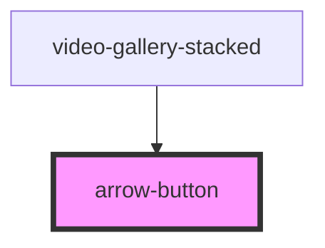

# arrow-button

<!-- Auto Generated Below -->

## Properties

| Property    | Attribute   | Description                          | Type         | Default     |
| ----------- | ----------- | ------------------------------------ | ------------ | ----------- |
| `callback`  | --          | The callback function for the button | `() => void` | `undefined` |
| `direction` | `direction` | The direction the arrow should point | `string`     | `'left'`    |
| `purple`    | `purple`    | The direction the arrow should point | `boolean`    | `false`     |

## Dependencies

### Used by

 - [video-gallery-stacked](../../videos/video-gallery-stacked)

### Graph

----------------------------------------------

*Built with [StencilJS](https://stenciljs.com/)*
