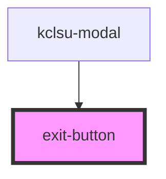

# exit-button

<!-- Auto Generated Below -->

## Properties

| Property   | Attribute | Description                                    | Type         | Default     |
| ---------- | --------- | ---------------------------------------------- | ------------ | ----------- |
| `callback` | --        | The callback function for the button           | `() => void` | `undefined` |
| `purple`   | `purple`  | Change the colour of the exit button to purple | `boolean`    | `false`     |

## Methods

### `addFocus() => Promise<void>`

#### Returns

Type: `Promise<void>`

## Dependencies

### Used by

 - [kclsu-modal](../../modal)

### Graph

----------------------------------------------

*Built with [StencilJS](https://stenciljs.com/)*
