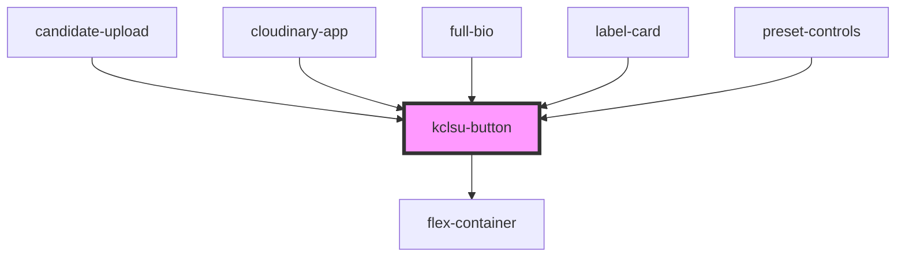

# kclsu-button

<!-- Auto Generated Below -->

## Properties

| Property    | Attribute   | Description                               | Type      | Default     |
| ----------- | ----------- | ----------------------------------------- | --------- | ----------- |
| `center`    | `center`    | Centers the button in the page            | `boolean` | `undefined` |
| `download`  | `download`  | Makes the link download                   | `boolean` | `undefined` |
| `emitid`    | `emitid`    | Event Listener name                       | `string`  | `undefined` |
| `green`     | `green`     |                                           | `boolean` | `undefined` |
| `icon`      | `icon`      | Adds icon to the page                     | `string`  | `undefined` |
| `link`      | `link`      | The URL to link to                        | `string`  | `undefined` |
| `newtab`    | `newtab`    | Opens the link in a new tab               | `boolean` | `undefined` |
| `purple`    | `purple`    | Make the button a secondary purple button | `boolean` | `undefined` |
| `rounded`   | `rounded`   | Give the button rounded corners           | `boolean` | `undefined` |
| `small`     | `small`     | Make the button small                     | `boolean` | `undefined` |
| `text`      | `text`      | The text for the button                   | `string`  | `undefined` |
| `verysmall` | `verysmall` | Makes the button very small               | `boolean` | `undefined` |

## Events

| Event       | Description | Type               |
| ----------- | ----------- | ------------------ |
| `emitClick` |             | `CustomEvent<any>` |

## Dependencies

### Used by

 - [candidate-upload](../../elections/candidate_upload)
 - [cloudinary-app](../../cloudinary)
 - [full-bio](../../profiles/bio)
 - [label-card](../../cards/label-card)
 - [preset-controls](../../cloudinary/preset-controls)

### Depends on

- [flex-container](../../containers/flex-container)

### Graph

----------------------------------------------

*Built with [StencilJS](https://stenciljs.com/)*
