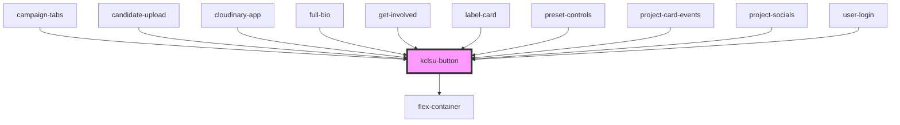

# kclsu-button

<!-- Auto Generated Below -->

## Properties

| Property     | Attribute    | Description                                                                                              | Type         | Default     |
| ------------ | ------------ | -------------------------------------------------------------------------------------------------------- | ------------ | ----------- |
| `center`     | `center`     | Centers the button in the page                                                                           | `boolean`    | `undefined` |
| `clickfn`    | --           | Provide a custom click function handler. Use emitid rather if a parent component is listening for event. | `() => void` | `undefined` |
| `download`   | `download`   | Makes the link download                                                                                  | `boolean`    | `undefined` |
| `emitid`     | `emitid`     | Event Listener name                                                                                      | `string`     | `undefined` |
| `fixedwidth` | `fixedwidth` | Give the button a fixed width                                                                            | `string`     | `undefined` |
| `icon`       | `icon`       | Adds icon to the page                                                                                    | `string`     | `undefined` |
| `link`       | `link`       | The URL to link to                                                                                       | `string`     | `undefined` |
| `margin`     | `margin`     | specifiy a margin, otherwise uses default                                                                | `string`     | `'15px'`    |
| `newtab`     | `newtab`     | Opens the link in a new tab                                                                              | `boolean`    | `undefined` |
| `purple`     | `purple`     | Make the button a secondary purple button                                                                | `boolean`    | `undefined` |
| `rounded`    | `rounded`    | Give the button rounded corners                                                                          | `boolean`    | `undefined` |
| `small`      | `small`      | Make the button small                                                                                    | `boolean`    | `undefined` |
| `text`       | `text`       | The text for the button                                                                                  | `string`     | `undefined` |
| `verysmall`  | `verysmall`  | Makes the button very small                                                                              | `boolean`    | `undefined` |

## Events

| Event       | Description | Type               |
| ----------- | ----------- | ------------------ |
| `emitClick` |             | `CustomEvent<any>` |

## Dependencies

### Used by

 - [campaign-tabs](../../projects/campaigns/campaign-tabs)
 - [candidate-upload](../../projects/elections/candidate_upload)
 - [cloudinary-app](../../projects/cloudinary)
 - [full-bio](../../profiles/bio)
 - [get-involved](../../projects/campaigns/get-involved)
 - [label-card](../../cards/label-card)
 - [preset-controls](../../projects/cloudinary/preset-controls)
 - [project-card-events](../../projects/projectpage/project-card/project-card-events)
 - [project-socials](../../projects/projectpage/project-socials)
 - [user-login](../../authentication/user-login)

### Depends on

- [flex-container](../../containers/flex-container)

### Graph

----------------------------------------------

*Built with [StencilJS](https://stenciljs.com/)*
