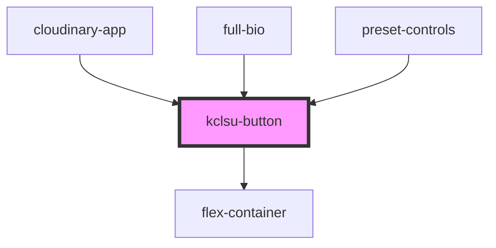

# kclsu-button

<!-- Auto Generated Below -->

## Properties

| Property   | Attribute  | Description                               | Type      | Default     |
| ---------- | ---------- | ----------------------------------------- | --------- | ----------- |
| `center`   | `center`   | Centers the button in the page            | `boolean` | `undefined` |
| `download` | `download` | Makes the link download                   | `boolean` | `undefined` |
| `emitid`   | `emitid`   | Event Listener name                       | `string`  | `undefined` |
| `green`    | `green`    |                                           | `boolean` | `undefined` |
| `icon`     | `icon`     | Adds specified icon to the page           | `string`  | `undefined` |
| `link`     | `link`     | The URL to link to                        | `string`  | `undefined` |
| `purple`   | `purple`   | Make the button a secondary purple button | `boolean` | `undefined` |
| `rounded`  | `rounded`  | Give the button rounded corners           | `boolean` | `undefined` |
| `small`    | `small`    | Make the button small                     | `boolean` | `undefined` |
| `text`     | `text`     | The text for the button                   | `string`  | `undefined` |

## Events

| Event       | Description | Type               |
| ----------- | ----------- | ------------------ |
| `emitClick` |             | `CustomEvent<any>` |

## Dependencies

### Used by

 - [cloudinary-app](../../cloudinary)
 - [full-bio](../../profiles/bio)
 - [preset-controls](../../cloudinary/preset-controls)

### Depends on

- [flex-container](../../containers/flex-container)

### Graph

----------------------------------------------

*Built with [StencilJS](https://stenciljs.com/)*
