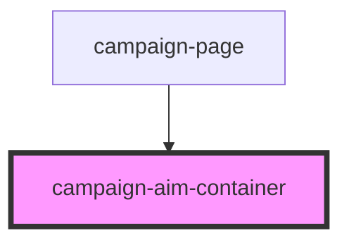

# campaign-aim-container

<!-- Auto Generated Below -->

## Properties

| Property       | Attribute      | Description | Type     | Default     |
| -------------- | -------------- | ----------- | -------- | ----------- |
| `campaignname` | `campaignname` |             | `string` | `undefined` |

## Dependencies

### Used by

 - [campaign-page](../campaign-page)

### Graph

----------------------------------------------

*Built with [StencilJS](https://stenciljs.com/)*
