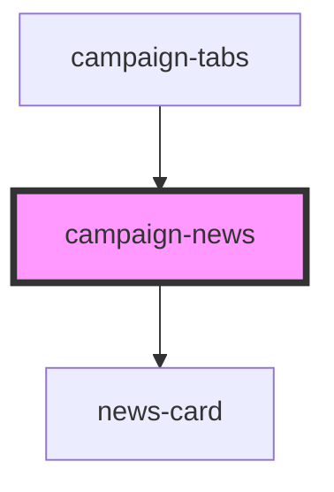

# campaign-news

<!-- Auto Generated Below -->

## Properties

| Property | Attribute | Description | Type     | Default     |
| -------- | --------- | ----------- | -------- | ----------- |
| `newsid` | `newsid`  |             | `string` | `undefined` |

## Dependencies

### Used by

 - [campaign-tabs](../campaign-tabs)

### Depends on

- [news-card](../../cards/news-card)

### Graph

----------------------------------------------

*Built with [StencilJS](https://stenciljs.com/)*
