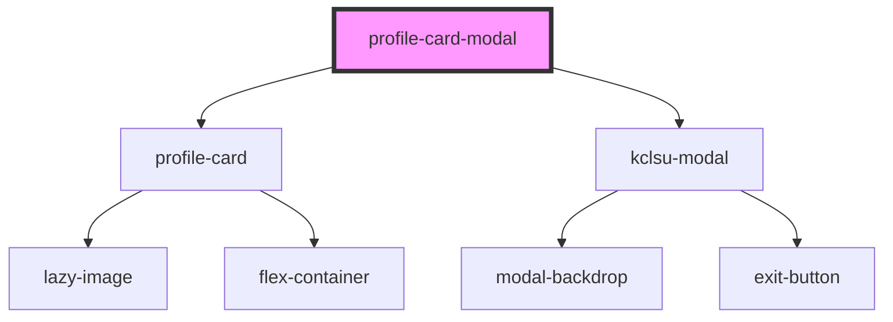

# profile-card-modal

<!-- Auto Generated Below -->

## Properties

| Property     | Attribute    | Description                                                           | Type     | Default           |
| ------------ | ------------ | --------------------------------------------------------------------- | -------- | ----------------- |
| `cta`        | `cta`        | The text for the primary text link bottom left                        | `string` | `'Find Out More'` |
| `image`      | `image`      | The image URL                                                         | `string` | `undefined`       |
| `link`       | `link`       | The URL link for the primary text link on the bottom left of the card | `string` | `undefined`       |
| `name`       | `name`       | The title for the card - usually a full name                          | `string` | `undefined`       |
| `position`   | `position`   | A sub heading - usually a position or field title                     | `string` | `undefined`       |
| `secondcta`  | `secondcta`  | The text for the secondary text link bottom right                     | `string` | `undefined`       |
| `secondlink` | `secondlink` | A second URL link for the bottom right of the card                    | `string` | `undefined`       |

## Dependencies

### Depends on

- [profile-card](../../profile-card)
- [kclsu-modal](../../../modal)

### Graph

----------------------------------------------

*Built with [StencilJS](https://stenciljs.com/)*
