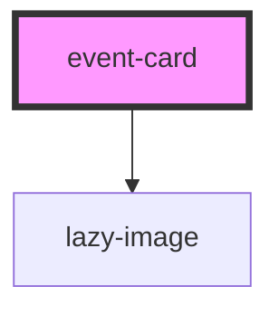

# event-card

<!-- Auto Generated Below -->

## Properties

| Property     | Attribute    | Description                                                                                                      | Type                                                            | Default     |
| ------------ | ------------ | ---------------------------------------------------------------------------------------------------------------- | --------------------------------------------------------------- | ----------- |
| `cardtitle`  | `cardtitle`  | The title for the card - usually a full name                                                                     | `string`                                                        | `undefined` |
| `date`       | `date`       | A sub heading - usually the date                                                                                 | `string`                                                        | `undefined` |
| `emitid`     | `emitid`     | The ID string for click events, using Stencil's Emitter. Only applies to card's bottom right link- DEVELOPER USE | `string`                                                        | `undefined` |
| `image`      | `image`      | The image URL                                                                                                    | `string`                                                        | `undefined` |
| `imagefocus` | `imagefocus` | Specifiy which part of the image to focus on. Defaults to center                                                 | `"bottom" \| "center" \| "faces" \| "left" \| "right" \| "top"` | `'center'`  |
| `link`       | `link`       | The URL link for the primary text link on the bottom left of the card                                            | `string`                                                        | `undefined` |
| `nolazy`     | `nolazy`     | Applies to lazy loading of images. Remove lazy loading                                                           | `boolean`                                                       | `false`     |
| `primaryfn`  | --           | A call back function to be supplied for the first (left hand side) call to action, as well as the clickable name | `() => void`                                                    | `undefined` |

## Events

| Event       | Description | Type               |
| ----------- | ----------- | ------------------ |
| `emitClick` |             | `CustomEvent<any>` |

## Methods

### `addFocus() => Promise<void>`

#### Returns

Type: `Promise<void>`

## Dependencies

### Depends on

- [lazy-image](../../images/lazy-image)

### Graph

----------------------------------------------

*Built with [StencilJS](https://stenciljs.com/)*
