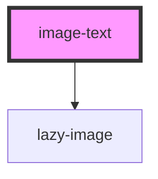

# image-text

<!-- Auto Generated Below -->

## Properties

| Property     | Attribute    | Description                                                                         | Type      | Default     |
| ------------ | ------------ | ----------------------------------------------------------------------------------- | --------- | ----------- |
| `heading`    | `heading`    | The title at the top of the text                                                    | `string`  | `undefined` |
| `image`      | `image`      | The image link (get from Cloudinary)                                                | `string`  | `undefined` |
| `imagezoom`  | `imagezoom`  | Animate the image (scale in) on scroll                                              | `boolean` | `false`     |
| `margin`     | `margin`     | Set the margin for the card                                                         | `string`  | `"0"`       |
| `smalltext`  | `smalltext`  | Applies to MOBILE / TABLET <780px screens only. Paragraph and heading sizes reduced | `boolean` | `undefined` |
| `switch`     | `switch`     | Switch the side the image is on                                                     | `boolean` | `undefined` |
| `text`       | `text`       | The paragraph text                                                                  | `string`  | `undefined` |
| `textcolour` | `textcolour` | Choose the colour for the paragraph text                                            | `string`  | `undefined` |

## Dependencies

### Depends on

- [lazy-image](../../images/lazy-image)

### Graph

----------------------------------------------

*Built with [StencilJS](https://stenciljs.com/)*
