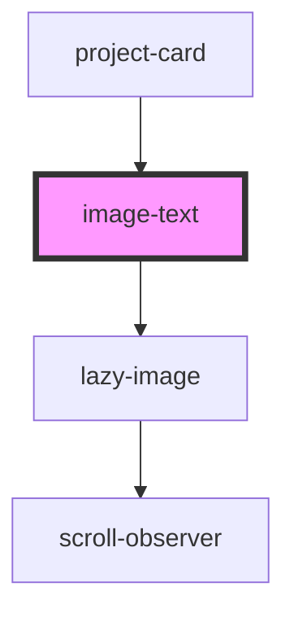

## image-text info

You can use this component in 2 ways:
1. As card, which gives the content area elavation and shadow
2. As a layout, positioning the image and text side by side.

The default is using it as a layout component. To make it a card, simply add the 'card' attribute.

<!-- Auto Generated Below -->

## Properties

| Property       | Attribute      | Description                                                                                                          | Type      | Default       |
| -------------- | -------------- | -------------------------------------------------------------------------------------------------------------------- | --------- | ------------- |
| `card`         | `card`         | This turns the component into a card, rather than just an image/text layout                                          | `boolean` | `undefined`   |
| `focusarea`    | `focusarea`    | The primary image focus area. standard CSS object-position values to set a focus area on the image. EG 'center left' | `string`  | `'center'`    |
| `heading`      | `heading`      | The title at the top of the text                                                                                     | `string`  | `undefined`   |
| `hideimage`    | `hideimage`    | Applies to mobilescreen displays only. Will hide the image and display content only                                  | `boolean` | `false`       |
| `image`        | `image`        | The image link (get from Cloudinary)                                                                                 | `string`  | `undefined`   |
| `imagewidth`   | `imagewidth`   | Provide a set % width for the image. Takes a  number without the % sign                                              | `string`  | `undefined`   |
| `imagezoom`    | `imagezoom`    | Animate the image (scale in) on scroll                                                                               | `boolean` | `false`       |
| `margin`       | `margin`       | Set the margin for the card                                                                                          | `string`  | `"45px auto"` |
| `reversestack` | `reversestack` | When the image and content stack, reverse the order so the image is on top                                           | `boolean` | `false`       |
| `smalltext`    | `smalltext`    | Applies to MOBILE / TABLET <780px screens only. Paragraph and heading sizes reduced                                  | `boolean` | `undefined`   |
| `switch`       | `switch`       | Switch the side the image is on.                                                                                     | `boolean` | `false`       |
| `text`         | `text`         | The paragraph text                                                                                                   | `string`  | `undefined`   |
| `textcolour`   | `textcolour`   | Choose the colour for the paragraph text                                                                             | `string`  | `undefined`   |

## Dependencies

### Used by

 - [project-card](../../projects/projectpage/project-card)

### Depends on

- [lazy-image](../../images/lazy-image)

### Graph

----------------------------------------------

*Built with [StencilJS](https://stenciljs.com/)*
