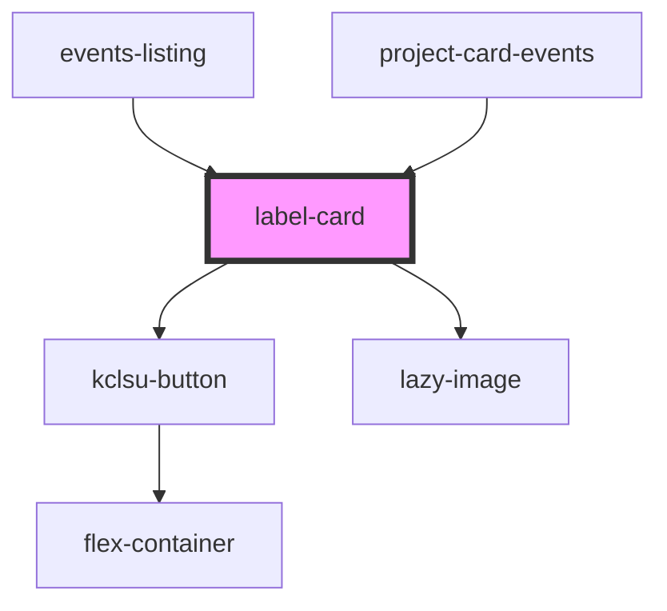

## label-card info

<!-- Auto Generated Below -->

## Properties

| Property         | Attribute        | Description                                            | Type      | Default                                                                                                                                       |
| ---------------- | ---------------- | ------------------------------------------------------ | --------- | --------------------------------------------------------------------------------------------------------------------------------------------- |
| `buttonlink`     | `buttonlink`     | If a button included, the link for the button          | `string`  | `undefined`                                                                                                                                   |
| `buttontitle`    | `buttontitle`    | If a button included, the text for the button          | `string`  | `'Find out more'`                                                                                                                             |
| `cardheight`     | `cardheight`     | Specify a fixed cardheight                             | `string`  | `undefined`                                                                                                                                   |
| `cardtitle`      | `cardtitle`      | The main title of the card                             | `string`  | `undefined`                                                                                                                                   |
| `cardwidth`      | `cardwidth`      | Specify a fixed card with                              | `string`  | `undefined`                                                                                                                                   |
| `highlightText`  | `highlight-text` | The main title of the card                             | `boolean` | `undefined`                                                                                                                                   |
| `image`          | `image`          | The image URL for the card. Defaults to the kclsu logo | `string`  | `'https://res.cloudinary.com/kclsu-media/image/upload/v1573644938/website_uploads/KCLSU%20Brand/db75df131542437eb3da2415c7f91fc6_hhoknp.jpg'` |
| `link`           | `link`           | The link for the card - NOT for the button             | `string`  | `undefined`                                                                                                                                   |
| `margin`         | `margin`         | Give the card a custom margin                          | `string`  | `undefined`                                                                                                                                   |
| `reverse`        | `reverse`        | If image to be displayed on right hand side            | `boolean` | `undefined`                                                                                                                                   |
| `smallestheight` | `smallestheight` | Make the card the smallest height possible             | `boolean` | `undefined`                                                                                                                                   |
| `smallheading`   | `smallheading`   | This will reduce the size of the heading in the card   | `boolean` | `undefined`                                                                                                                                   |
| `text`           | `text`           | The sub text beneath the title                         | `string`  | `undefined`                                                                                                                                   |

## Dependencies

### Used by

 - [events-listing](../../containers/events-listing)
 - [project-card-events](../../projects/projectpage/project-card/project-card-events)

### Depends on

- [kclsu-button](../../buttons/kclsu-button)
- [lazy-image](../../images/lazy-image)

### Graph

----------------------------------------------

*Built with [StencilJS](https://stenciljs.com/)*
