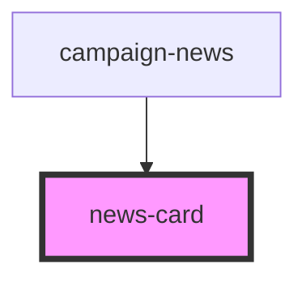

### News Card info
<!-- Auto Generated Below -->

## Properties

| Property    | Attribute   | Description                    | Type     | Default     |
| ----------- | ----------- | ------------------------------ | -------- | ----------- |
| `newslink`  | `newslink`  | The MSL link for the news post | `string` | `undefined` |
| `newstitle` | `newstitle` | The title for the news post    | `string` | `undefined` |

## Dependencies

### Used by

 - [campaign-news](../../projects/campaigns/campaign-news)

### Graph

----------------------------------------------

*Built with [StencilJS](https://stenciljs.com/)*
