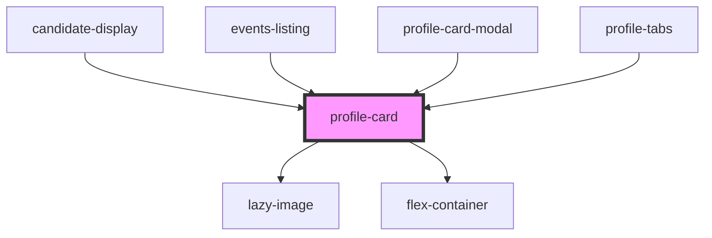

## profile-card info

This card is used to display a profile of someone. It contains an image, a title (name), a subtitle (position), and then 2 clickable links at the bottom.

These clickable links can be configured as follows:

### Primary Link
A Primary clickable url link at the bottom left of the card. This url link is also used for the title (name) of the profile card. When clicked, a page will open on a new tab.

### Secondary Link
A Secondary clickable url link at the bottom right of the card. When clicked, a page will open on a new tab. If no call to action text is supplied (using the secondcta attribute) this link will not display.

### Swap Links for Callbacks
Instead of supplying a URL link for both primary and secondary links, you can supply callback functions instead (primaryfn and secondaryfn attributes) 

<!-- Auto Generated Below -->

## Properties

| Property      | Attribute    | Description                                                                                                      | Type         | Default                                                                                                                                                           |
| ------------- | ------------ | ---------------------------------------------------------------------------------------------------------------- | ------------ | ----------------------------------------------------------------------------------------------------------------------------------------------------------------- |
| `cta`         | `cta`        | The text for the primary text link bottom left                                                                   | `string`     | `'Find Out More'`                                                                                                                                                 |
| `emitid`      | `emitid`     | The ID string for click events, using Stencil's Emitter. Only applies to card's bottom right link- DEVELOPER USE | `string`     | `undefined`                                                                                                                                                       |
| `image`       | `image`      | The image URL                                                                                                    | `string`     | `'https://res.cloudinary.com/kclsu-media/image/upload/f_auto,fl_any_format,g_center,q_100/v1581516201/website_uploads/KCLSU%20Brand/Bzcl1r6L_400x400_se7grm.jpg'` |
| `link`        | `link`       | The URL link for the primary text link on the bottom left of the card                                            | `string`     | `undefined`                                                                                                                                                       |
| `name`        | `name`       | The title for the card - usually a full name                                                                     | `string`     | `undefined`                                                                                                                                                       |
| `nolazy`      | `nolazy`     | Applies to lazy loading of images. Remove lazy loading                                                           | `boolean`    | `false`                                                                                                                                                           |
| `position`    | `position`   | A sub heading - usually a position or field title                                                                | `string`     | `undefined`                                                                                                                                                       |
| `primaryfn`   | --           | A call back function to be supplied for the first (left hand side) call to action, as well as the clickable name | `() => void` | `undefined`                                                                                                                                                       |
| `secondaryfn` | --           | A call back function to be supplied for the second (right hand side) call to action                              | `() => void` | `undefined`                                                                                                                                                       |
| `secondcta`   | `secondcta`  | The text for the secondary text link bottom right                                                                | `string`     | `undefined`                                                                                                                                                       |
| `secondlink`  | `secondlink` | A second URL link for the bottom right of the card                                                               | `string`     | `undefined`                                                                                                                                                       |

## Events

| Event       | Description | Type               |
| ----------- | ----------- | ------------------ |
| `emitClick` |             | `CustomEvent<any>` |

## Methods

### `addFocus() => Promise<void>`

#### Returns

Type: `Promise<void>`

## Dependencies

### Used by

 - [candidate-display](../../projects/elections/elections-candidates/candidates-display)
 - [events-listing](../../containers/events-listing)
 - [profile-card-modal](../cards-with-modals/profile-card-modal)
 - [profile-tabs](../../profiles)

### Depends on

- [lazy-image](../../images/lazy-image)
- [flex-container](../../containers/flex-container)

### Graph

----------------------------------------------

*Built with [StencilJS](https://stenciljs.com/)*
