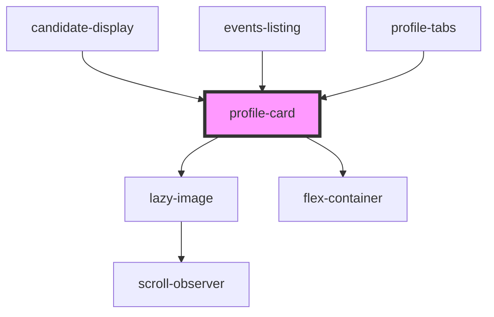

# profile-card

<!-- Auto Generated Below -->

## Properties

| Property     | Attribute    | Description                                                                             | Type      | Default                                                                                                                                                           |
| ------------ | ------------ | --------------------------------------------------------------------------------------- | --------- | ----------------------------------------------------------------------------------------------------------------------------------------------------------------- |
| `cta`        | `cta`        | The text for the primary text link bottom left                                          | `string`  | `'Find Out More'`                                                                                                                                                 |
| `emitid`     | `emitid`     | The ID string for click events. Only applies to card's bottom right link- DEVELOPER USE | `string`  | `undefined`                                                                                                                                                       |
| `image`      | `image`      | The image URL                                                                           | `string`  | `'https://res.cloudinary.com/kclsu-media/image/upload/f_auto,fl_any_format,g_center,q_100/v1581516201/website_uploads/KCLSU%20Brand/Bzcl1r6L_400x400_se7grm.jpg'` |
| `link`       | `link`       | The URL link for the primary text link on the bottom left of the card                   | `string`  | `undefined`                                                                                                                                                       |
| `name`       | `name`       | The title for the card - usually a full name                                            | `string`  | `undefined`                                                                                                                                                       |
| `nolazy`     | `nolazy`     | Applies to lazy loading of images. Remove lazy loading                                  | `boolean` | `false`                                                                                                                                                           |
| `position`   | `position`   | A sub heading - usually a position or field title                                       | `string`  | `undefined`                                                                                                                                                       |
| `secondcta`  | `secondcta`  | The text for the secondary text link bottom right                                       | `string`  | `undefined`                                                                                                                                                       |
| `secondlink` | `secondlink` | A second URL link for the bottom right of the card                                      | `string`  | `undefined`                                                                                                                                                       |

## Events

| Event       | Description | Type               |
| ----------- | ----------- | ------------------ |
| `emitClick` |             | `CustomEvent<any>` |

## Dependencies

### Used by

 - [candidate-display](../../projects/elections/elections-candidates/candidates-display)
 - [events-listing](../../containers/events-listing)
 - [profile-tabs](../../profiles)

### Depends on

- [lazy-image](../../images/lazy-image)
- [flex-container](../../containers/flex-container)

### Graph

----------------------------------------------

*Built with [StencilJS](https://stenciljs.com/)*
