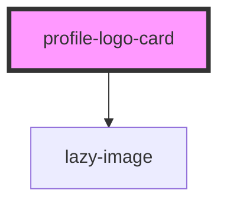

## profile-logo-card info

The cards are usually used for student groups, venues or external organisations.

<!-- Auto Generated Below -->

## Properties

| Property                 | Attribute    | Description                                                                             | Type     | Default                                                                                                                                                           |
| ------------------------ | ------------ | --------------------------------------------------------------------------------------- | -------- | ----------------------------------------------------------------------------------------------------------------------------------------------------------------- |
| `cardtitle` _(required)_ | `cardtitle`  | The text title of the card                                                              | `string` | `undefined`                                                                                                                                                       |
| `image`                  | `image`      | The background image URL                                                                | `string` | `'https://res.cloudinary.com/kclsu-media/image/upload/f_auto,fl_any_format,g_center,q_100/v1581516201/website_uploads/KCLSU%20Brand/Bzcl1r6L_400x400_se7grm.jpg'` |
| `imagefocus`             | `imagefocus` | Specify which part of the image you want to focus - top, bottom, right, left, center    | `string` | `undefined`                                                                                                                                                       |
| `link`                   | `link`       | The URL link for the the card                                                           | `string` | `undefined`                                                                                                                                                       |
| `logo`                   | `logo`       | The logo image URL - at least 150x150px, must be a square image.                        | `string` | `undefined`                                                                                                                                                       |
| `logocolour`             | `logocolour` | OPTIONAL - if you are using a transparent text icon and need to set a background colour | `string` | `undefined`                                                                                                                                                       |

## Dependencies

### Depends on

- [lazy-image](../../images/lazy-image)

### Graph

----------------------------------------------

*Built with [StencilJS](https://stenciljs.com/)*
