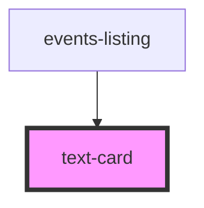

## text-card info

<!-- Auto Generated Below -->

## Properties

| Property                 | Attribute   | Description                                                             | Type     | Default     |
| ------------------------ | ----------- | ----------------------------------------------------------------------- | -------- | ----------- |
| `cardtitle` _(required)_ | `cardtitle` | The purple heading in the card                                          | `string` | `undefined` |
| `link`                   | `link`      | The Url link you want to link to                                        | `string` | `undefined` |
| `subtext`                | `subtext`   | Any extra text. If you want it to be empty, add empty string value:  "" | `string` | `undefined` |

## Dependencies

### Used by

 - [events-listing](../../containers/events-listing)

### Graph

----------------------------------------------

*Built with [StencilJS](https://stenciljs.com/)*
