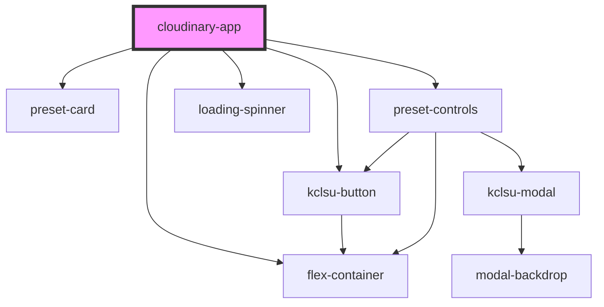

# cloudinary-app

<!-- Auto Generated Below -->

## Properties

| Property    | Attribute   | Description | Type     | Default     |
| ----------- | ----------- | ----------- | -------- | ----------- |
| `public_id` | `public_id` |             | `string` | `undefined` |

## Dependencies

### Depends on

- [preset-card](preset-card)
- [flex-container](../containers/flex-container)
- [kclsu-button](../buttons/kclsu-button)
- [preset-controls](preset-controls)
- [loading-spinner](../spinner)

### Graph

----------------------------------------------

*Built with [StencilJS](https://stenciljs.com/)*
