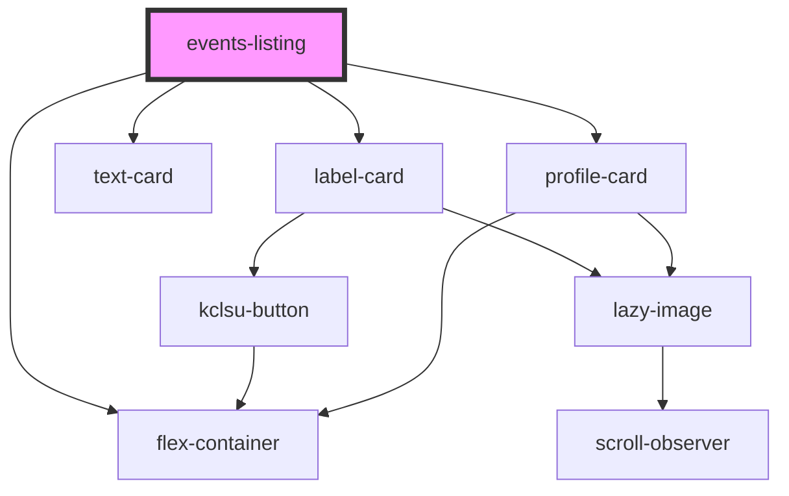

# events-listing

<!-- Auto Generated Below -->

## Properties

| Property                | Attribute  | Description                                          | Type                             | Default     |
| ----------------------- | ---------- | ---------------------------------------------------- | -------------------------------- | ----------- |
| `cardtype`              | `cardtype` | Choose the card component for each event             | `"label" \| "profile" \| "text"` | `'label'`   |
| `col`                   | `col`      | Show event cards in a column                         | `boolean`                        | `undefined` |
| `cta`                   | `cta`      | The Call To Action text in the link on profile cards | `string`                         | `undefined` |
| `eventtag` _(required)_ | `eventtag` | The MSL event tag to filter events                   | `string`                         | `undefined` |
| `limit`                 | `limit`    | The max number of events to display                  | `string`                         | `undefined` |

## Dependencies

### Depends on

- [label-card](../../cards/label-card)
- [text-card](../../cards/text-card)
- [profile-card](../../cards/profile-card)
- [flex-container](../flex-container)

### Graph

----------------------------------------------

*Built with [StencilJS](https://stenciljs.com/)*
