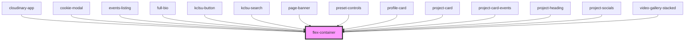

# flex-container

<!-- Auto Generated Below -->

## Properties

| Property        | Attribute       | Description                                                                  | Type      | Default     |
| --------------- | --------------- | ---------------------------------------------------------------------------- | --------- | ----------- |
| `alignx`        | `alignx`        | The same as the 'justify-content' flex property along the x axis             | `string`  | `undefined` |
| `aligny`        | `aligny`        | The same as the 'align-items' flex property along the y axis                 | `string`  | `undefined` |
| `direction`     | `direction`     | Set the flex direction: column, reverse-column, row, reverse-row             | `string`  | `undefined` |
| `fillcontainer` | `fillcontainer` | Ensure the container stretches the full width and height of parent container | `boolean` | `undefined` |
| `mobcolumn`     | `mobcolumn`     | In mobile display in column direction - NOT YET RELEASED                     | `boolean` | `undefined` |
| `renderlist`    | `renderlist`    | If the parent container element needs to be an <ul> list element             | `boolean` | `false`     |
| `wrap`          | `wrap`          | Add flex-wrap to flex items                                                  | `boolean` | `undefined` |

## Dependencies

### Used by

 - [cloudinary-app](../../projects/cloudinary)
 - [cookie-modal](../../modal/cookie-modal)
 - [events-listing](../events-listing)
 - [full-bio](../../profiles/bio)
 - [kclsu-button](../../buttons/kclsu-button)
 - [kclsu-search](../../search/kclsu-search)
 - [page-banner](../../banners/page-banner)
 - [preset-controls](../../projects/cloudinary/preset-controls)
 - [profile-card](../../cards/profile-card)
 - [project-card](../../projects/projectpage/project-card)
 - [project-card-events](../../projects/projectpage/project-card/project-card-events)
 - [project-heading](../../projects/projectpage/project-heading)
 - [project-socials](../../projects/projectpage/project-socials)
 - [video-gallery-stacked](../../videos/video-gallery-stacked)

### Graph

----------------------------------------------

*Built with [StencilJS](https://stenciljs.com/)*
