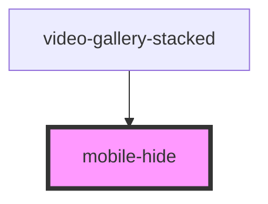

# mobile-hide

Use this component to hide content on mobile screens.

<!-- Auto Generated Below -->

## Properties

| Property     | Attribute    | Description                                                                                              | Type      | Default |
| ------------ | ------------ | -------------------------------------------------------------------------------------------------------- | --------- | ------- |
| `hidetablet` | `hidetablet` | In addition to hiding all children in screens mobile, this will hide content in screens tablet + smaller | `boolean` | `false` |

## Dependencies

### Used by

 - [video-gallery-stacked](../../videos/video-gallery-stacked)

### Graph

----------------------------------------------

*Built with [StencilJS](https://stenciljs.com/)*
