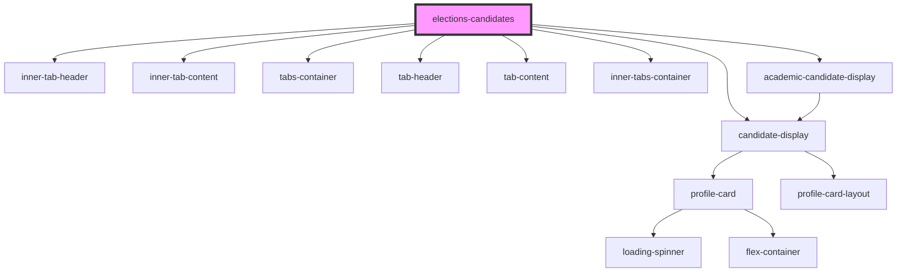

# elections-candidates

<!-- Auto Generated Below -->

## Properties

| Property  | Attribute | Description | Type      | Default     |
| --------- | --------- | ----------- | --------- | ----------- |
| `results` | `results` |             | `boolean` | `undefined` |

## Dependencies

### Depends on

- [inner-tab-header](../../tabs/innertabs/inner-tab-header)
- [inner-tab-content](../../tabs/innertabs/inner-tab-content)
- [candidate-display](candidates-display)
- [tabs-container](../../tabs/primarytabs)
- [tab-header](../../tabs/primarytabs/tab-header)
- [tab-content](../../tabs/primarytabs/tab-content)
- [inner-tabs-container](../../tabs/innertabs)
- [academic-candidate-display](academic-candidates-display)

### Graph

----------------------------------------------

*Built with [StencilJS](https://stenciljs.com/)*
