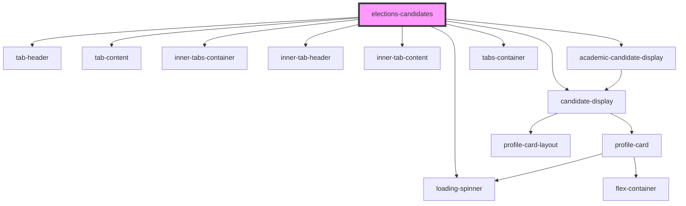

# elections-candidates

<!-- Auto Generated Below -->

## Properties

| Property          | Attribute         | Description                                                                                                                                                                              | Type      | Default     |
| ----------------- | ----------------- | ---------------------------------------------------------------------------------------------------------------------------------------------------------------------------------------- | --------- | ----------- |
| `academicgroups`  | `academicgroups`  | A string lof either Faculties or Association search terms, separated by the \| sign. PLEASE NOTE: The name will be used to filter all roles, as well as be used for the Tab Header title | `any`     | `undefined` |
| `activeid`        | `activeid`        | The primary acrtive tab that will be open on page load                                                                                                                                   | `string`  | `'SO'`      |
| `electionid`      | `electionid`      | The election ID from MSL!                                                                                                                                                                | `string`  | `undefined` |
| `networkofficers` | `networkofficers` | A string of exact role names for network officers, separated by the \| sign                                                                                                              | `any`     | `undefined` |
| `results`         | `results`         | Set to true to display results data. False to display All Candidates                                                                                                                     | `boolean` | `false`     |
| `studentofficers` | `studentofficers` | A string of exact role names for student officers, separated by the \| sign                                                                                                              | `any`     | `undefined` |

## Dependencies

### Depends on

- [tab-header](../../tabs/primarytabs/tab-header)
- [tab-content](../../tabs/primarytabs/tab-content)
- [candidate-display](candidates-display)
- [inner-tabs-container](../../tabs/innertabs)
- [inner-tab-header](../../tabs/innertabs/inner-tab-header)
- [inner-tab-content](../../tabs/innertabs/inner-tab-content)
- [academic-candidate-display](academic-candidates-display)
- [loading-spinner](../../spinner)
- [tabs-container](../../tabs/primarytabs)

### Graph

----------------------------------------------

*Built with [StencilJS](https://stenciljs.com/)*
