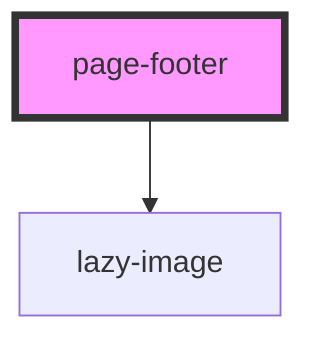

# page-footer

<!-- Auto Generated Below -->

## Properties

| Property    | Attribute   | Description | Type     | Default     |
| ----------- | ----------- | ----------- | -------- | ----------- |
| `bgcolor`   | `bgcolor`   |             | `string` | `'orange'`  |
| `colone`    | `colone`    |             | `string` | `undefined` |
| `colthree`  | `colthree`  |             | `string` | `undefined` |
| `coltwo`    | `coltwo`    |             | `string` | `undefined` |
| `logo`      | `logo`      |             | `string` | `undefined` |
| `textcolor` | `textcolor` |             | `string` | `'white'`   |

## Dependencies

### Depends on

- [lazy-image](../images/lazy-image)

### Graph

----------------------------------------------

*Built with [StencilJS](https://stenciljs.com/)*
