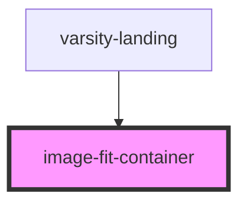

# image-fit-container

<!-- Auto Generated Below -->

## Properties

| Property  | Attribute | Description | Type       | Default     |
| --------- | --------- | ----------- | ---------- | ----------- |
| `alt`     | `alt`     |             | `string`   | `undefined` |
| `classes` | --        |             | `string[]` | `undefined` |
| `src`     | `src`     |             | `string`   | `undefined` |

## Dependencies

### Used by

 - [varsity-landing](../../varsity/varsity-landing)

### Graph

----------------------------------------------

*Built with [StencilJS](https://stenciljs.com/)*
