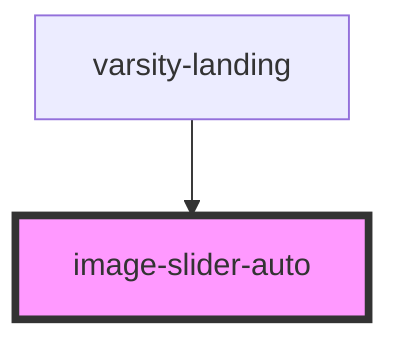

# image-slider-auto

<!-- Auto Generated Below -->

## Properties

| Property   | Attribute  | Description        | Type       | Default            |
| ---------- | ---------- | ------------------ | ---------- | ------------------ |
| `classes`  | `classes`  |                    | `string`   | `'slide-in-right'` |
| `images`   | --         | A string of images | `string[]` | `undefined`        |
| `interval` | `interval` |                    | `number`   | `undefined`        |

## CSS Custom Properties

| Name                                                                                                         | Description |
| ------------------------------------------------------------------------------------------------------------ | ----------- |
| `---------------------------------------- animation slide-in-right ----------------------------------------` |             |

## Dependencies

### Used by

 - [varsity-landing](../../varsity/varsity-landing)

### Graph

----------------------------------------------

*Built with [StencilJS](https://stenciljs.com/)*
