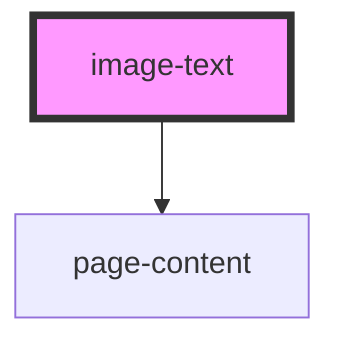

# image-text

<!-- Auto Generated Below -->

## Properties

| Property  | Attribute | Description                          | Type      | Default     |
| --------- | --------- | ------------------------------------ | --------- | ----------- |
| `heading` | `heading` | The title at the top of the text     | `string`  | `undefined` |
| `image`   | `image`   | The paragraph text                   | `string`  | `undefined` |
| `switch`  | `switch`  | Switch the side the image is on      | `boolean` | `undefined` |
| `text`    | `text`    | The image link (get from Cloudinary) | `string`  | `undefined` |

## Dependencies

### Depends on

- [page-content](../../containers/page-content)

### Graph

----------------------------------------------

*Built with [StencilJS](https://stenciljs.com/)*
