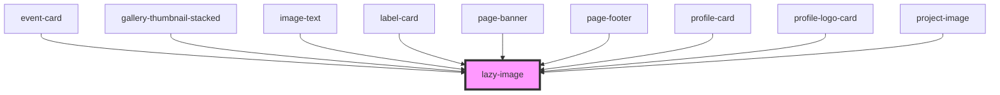

# lazy-image

<!-- Auto Generated Below -->

## Properties

| Property           | Attribute          | Description                                                                                                                               | Type      | Default     |
| ------------------ | ------------------ | ----------------------------------------------------------------------------------------------------------------------------------------- | --------- | ----------- |
| `alt`              | `alt`              | The alt tag of the image                                                                                                                  | `string`  | `''`        |
| `animatein`        | `animatein`        | Image will scale into view                                                                                                                | `boolean` | `false`     |
| `customtransform`  | `customtransform`  | Provide a custom cloudinary transformation. Must be in format: string,string,string eg: c_fill,f_auto,fl_any_format                       | `string`  | `undefined` |
| `desktop`          | `desktop`          | The % percentage of desktop screens the image will take up. Number only without percent symbol                                            | `string`  | `"100"`     |
| `focusarea`        | `focusarea`        | Use standard CSS object-position values to set a focus area on the image. EG 'center left'                                                | `string`  | `'center'`  |
| `image`            | `image`            | The image URL. Must be a kclsu, cloudinary or kclsu firebase url                                                                          | `string`  | `undefined` |
| `minwidth`         | `minwidth`         | Set a minimum pixel width for the image rendered                                                                                          | `string`  | `undefined` |
| `mobile`           | `mobile`           | The % percentage of mobile screens the image will take up. Number only without percent symbol                                             | `string`  | `"100"`     |
| `nolazy`           | `nolazy`           | Remove lazy-loading functionality. Retains Object Fit positioing                                                                          | `boolean` | `false`     |
| `plainimg`         | `plainimg`         | If you want to render an img element in a responsive container without object positioning                                                 | `boolean` | `false`     |
| `ratio`            | `ratio`            | A ratio for the image in decimal form. This will fetch the image from cloudinary with an appropriate height at each responsive breakpoint | `string`  | `undefined` |
| `suppliedwidth`    | `suppliedwidth`    | Recommended. Provide the exact width for the image supplied                                                                               | `string`  | `undefined` |
| `withtransparency` | `withtransparency` | Render image an a PNG with transparency                                                                                                   | `boolean` | `undefined` |

## Dependencies

### Used by

 - [event-card](../../cards/event-card)
 - [gallery-thumbnail-stacked](../../videos/video-gallery-stacked/gallery-thumbnail-stacked)
 - [image-text](../../cards/image-text)
 - [label-card](../../cards/label-card)
 - [page-banner](../../banners/page-banner)
 - [page-footer](../../footer)
 - [profile-card](../../cards/profile-card)
 - [profile-logo-card](../../cards/profile-logo-card)
 - [project-image](../../projects/projectpage/project-image)

### Graph

----------------------------------------------

*Built with [StencilJS](https://stenciljs.com/)*
