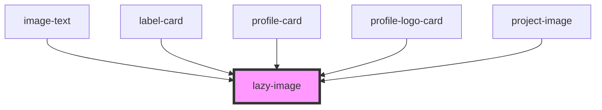

# lazy-image

<!-- Auto Generated Below -->

## Properties

| Property       | Attribute      | Description                                                                                          | Type      | Default                                                                                                                                                           |
| -------------- | -------------- | ---------------------------------------------------------------------------------------------------- | --------- | ----------------------------------------------------------------------------------------------------------------------------------------------------------------- |
| `animatein`    | `animatein`    | Image will scale into view                                                                           | `boolean` | `false`                                                                                                                                                           |
| `desktopwidth` | `desktopwidth` | If setting width for mobile and desktop, use width property for mobile and this property for desktop | `string`  | `undefined`                                                                                                                                                       |
| `focusarea`    | `focusarea`    | Use standard CSS values to set a focus area on the image. EG 'center left'                           | `string`  | `'center'`                                                                                                                                                        |
| `image`        | `image`        |                                                                                                      | `string`  | `'https://res.cloudinary.com/kclsu-media/image/upload/f_auto,fl_any_format,g_center,q_100/v1581516201/website_uploads/KCLSU%20Brand/Bzcl1r6L_400x400_se7grm.jpg'` |
| `width`        | `width`        | A width for the image in pixels                                                                      | `string`  | `'500'`                                                                                                                                                           |

## Dependencies

### Used by

 - [image-text](../../cards/image-text)
 - [label-card](../../cards/label-card)
 - [profile-card](../../cards/profile-card)
 - [profile-logo-card](../../cards/profile-logo-card)
 - [project-image](../../projects/projectpage/project-image)

### Graph

----------------------------------------------

*Built with [StencilJS](https://stenciljs.com/)*
