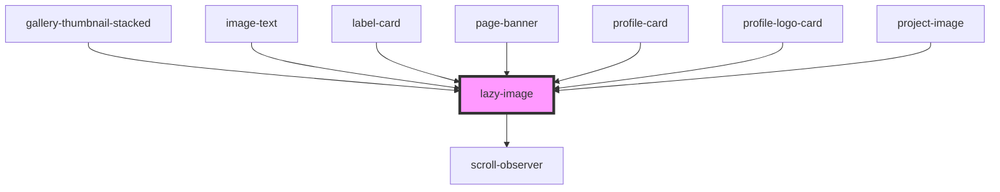

# lazy-image

<!-- Auto Generated Below -->

## Properties

| Property       | Attribute      | Description                                                                                          | Type      | Default     |
| -------------- | -------------- | ---------------------------------------------------------------------------------------------------- | --------- | ----------- |
| `alt`          | `alt`          | The alt tag of the image                                                                             | `string`  | `''`        |
| `animatein`    | `animatein`    | Image will scale into view                                                                           | `boolean` | `false`     |
| `contentimage` | `contentimage` | If the image is being used only as thumbnail, such as project-cards and image-text components        | `boolean` | `false`     |
| `desktopwidth` | `desktopwidth` | If setting width for mobile and desktop, use width property for mobile and this property for desktop | `string`  | `undefined` |
| `focusarea`    | `focusarea`    | Use standard CSS object-position values to set a focus area on the image. EG 'center left'           | `string`  | `'center'`  |
| `image`        | `image`        |                                                                                                      | `string`  | `undefined` |
| `nolazy`       | `nolazy`       | Remove lazy-loading functionality. Retains Object Fit positioing                                     | `boolean` | `false`     |
| `plainimg`     | `plainimg`     | If you want to render an img element in a responsive container without object positioning            | `boolean` | `false`     |
| `thumbnail`    | `thumbnail`    | If the image is being used only as thumbnail, such as in event cards, label cards and profile cards  | `boolean` | `false`     |
| `width`        | `width`        | A width for the image in pixels                                                                      | `string`  | `undefined` |

## Dependencies

### Used by

 - [gallery-thumbnail-stacked](../../videos/video-gallery-stacked/gallery-thumbnail-stacked)
 - [image-text](../../cards/image-text)
 - [label-card](../../cards/label-card)
 - [page-banner](../../banners/page-banner)
 - [profile-card](../../cards/profile-card)
 - [profile-logo-card](../../cards/profile-logo-card)
 - [project-image](../../projects/projectpage/project-image)

### Depends on

- [scroll-observer](../../scroll)

### Graph

----------------------------------------------

*Built with [StencilJS](https://stenciljs.com/)*
