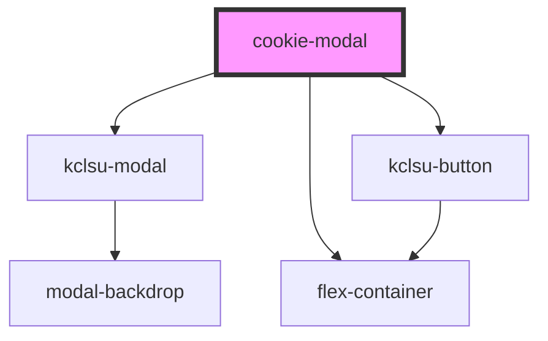

# cookie-modal

<!-- Auto Generated Below -->

## Properties

| Property    | Attribute   | Description | Type                              | Default     |
| ----------- | ----------- | ----------- | --------------------------------- | ----------- |
| `config`    | --          |             | `{ [name: string]: () => void; }` | `undefined` |
| `daysvalid` | `daysvalid` |             | `number`                          | `30`        |
| `devmode`   | `devmode`   |             | `boolean`                         | `false`     |

## Dependencies

### Depends on

- [kclsu-modal](..)
- [flex-container](../../containers/flex-container)
- [kclsu-button](../../buttons/kclsu-button)

### Graph

----------------------------------------------

*Built with [StencilJS](https://stenciljs.com/)*
