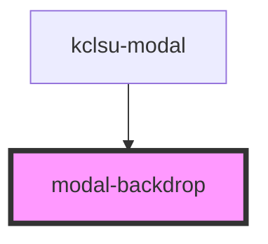

# modal-backdrop

<!-- Auto Generated Below -->

## Properties

| Property   | Attribute  | Description                                 | Type      | Default     |
| ---------- | ---------- | ------------------------------------------- | --------- | ----------- |
| `position` | `position` | NEVER set directly. Set in parent component | `string`  | `undefined` |
| `showbg`   | `showbg`   | NEVER set directly. Set in parent component | `boolean` | `undefined` |

## Events

| Event       | Description | Type               |
| ----------- | ----------- | ------------------ |
| `exitModal` |             | `CustomEvent<any>` |

## Dependencies

### Used by

 - [kclsu-modal](.)

### Graph

----------------------------------------------

*Built with [StencilJS](https://stenciljs.com/)*
