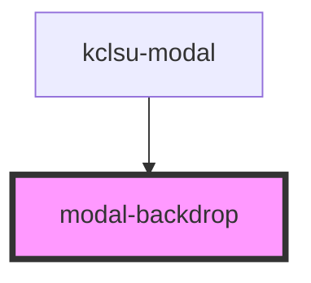

# modal-backdrop

<!-- Auto Generated Below -->

## Properties

| Property | Attribute | Description | Type      | Default     |
| -------- | --------- | ----------- | --------- | ----------- |
| `showbg` | `showbg`  |             | `boolean` | `undefined` |

## Events

| Event       | Description | Type               |
| ----------- | ----------- | ------------------ |
| `exitModal` |             | `CustomEvent<any>` |

## Dependencies

### Used by

 - [kclsu-modal](.)

### Graph

----------------------------------------------

*Built with [StencilJS](https://stenciljs.com/)*
