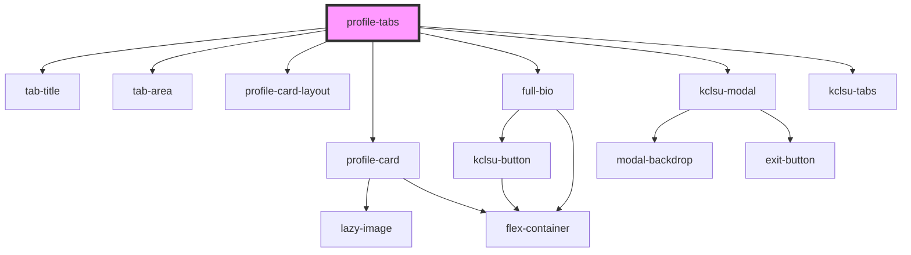

## profile-tabs info

This component renders a tab interface, with embedded profile cards. 

Besides the database URL from where the data will bne fetched, the component needs to know the following information:
- 

<!-- Auto Generated Below -->

## Properties

| Property   | Attribute  | Description                                                                | Type     | Default                                                                                                                                     |
| ---------- | ---------- | -------------------------------------------------------------------------- | -------- | ------------------------------------------------------------------------------------------------------------------------------------------- |
| `activeid` | `activeid` | Specify Tab ID you want to keep open by default                            | `string` | `'Tab1'`                                                                                                                                    |
| `database` | `database` | The URL of the database to fetch profiles from (firebase)                  | `string` | `undefined`                                                                                                                                 |
| `headings` | `headings` | Array with child arrays containing Tab Heading, Tab ID, and Text(optional) | `any`    | `[['First Tab', 'Tab1', 'A maximum of two lines of text can go here. This is meant only as a brief introduction'], ['Second Tab', 'Tab2']]` |

## Dependencies

### Depends on

- [tab-title](../tabs/kclsu-tabs/tab-title)
- [tab-area](../tabs/kclsu-tabs/tab-area)
- [profile-card-layout](../containers/profile-card-layout)
- [profile-card](../cards/profile-card)
- [full-bio](bio)
- [kclsu-modal](../modal)
- [kclsu-tabs](../tabs/kclsu-tabs)

### Graph

----------------------------------------------

*Built with [StencilJS](https://stenciljs.com/)*
