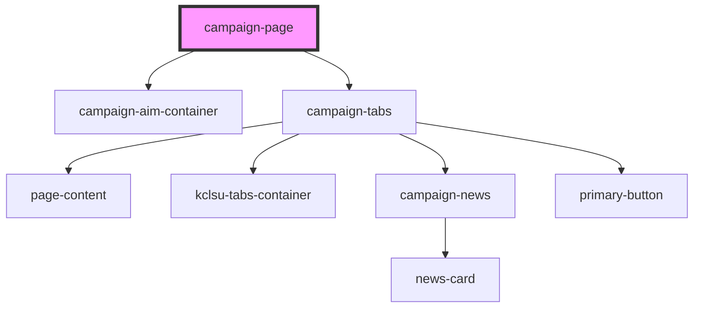

# campaign-page

<!-- Auto Generated Below -->

## Properties

| Property     | Attribute     | Description | Type     | Default     |
| ------------ | ------------- | ----------- | -------- | ----------- |
| `campaignId` | `campaign-id` |             | `number` | `undefined` |
| `name`       | `name`        |             | `string` | `undefined` |

## Dependencies

### Depends on

- [campaign-aim-container](../campaign-aim-container)
- [campaign-tabs](../campaign-tabs)

### Graph

----------------------------------------------

*Built with [StencilJS](https://stenciljs.com/)*
