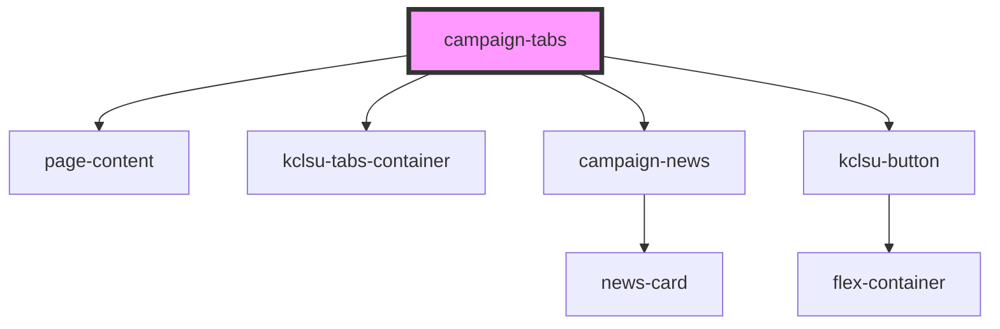

# campaign-tabs

<!-- Auto Generated Below -->

## Properties

| Property      | Attribute     | Description                                                                                           | Type     | Default     |
| ------------- | ------------- | ----------------------------------------------------------------------------------------------------- | -------- | ----------- |
| `facebook`    | `facebook`    | The URL of the facebook page or group                                                                 | `string` | `undefined` |
| `newsid`      | `newsid`      | The MSL organisation ID where the news is kept                                                        | `string` | `undefined` |
| `strategydoc` | `strategydoc` | The URL of the document for the Strategy Doc uploaded under Resources for that campaign organisation. | `string` | `undefined` |

## Dependencies

### Depends on

- [page-content](../../../containers/page-content)
- [kclsu-tabs-container](../../../tabs/kclsu-tabs)
- [campaign-news](../campaign-news)
- [kclsu-button](../../../buttons/kclsu-button)

### Graph

----------------------------------------------

*Built with [StencilJS](https://stenciljs.com/)*
