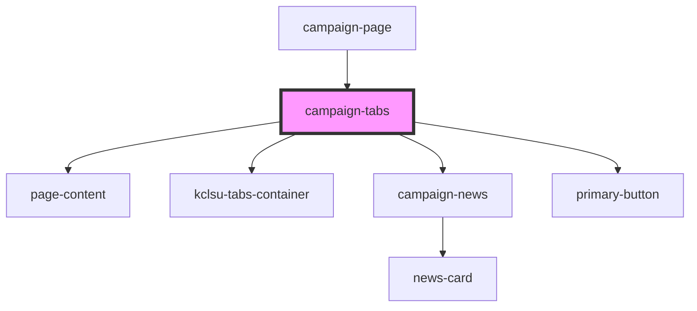

# campaign-tabs

<!-- Auto Generated Below -->

## Properties

| Property      | Attribute     | Description | Type     | Default     |
| ------------- | ------------- | ----------- | -------- | ----------- |
| `facebook`    | `facebook`    |             | `string` | `undefined` |
| `newsid`      | `newsid`      |             | `string` | `undefined` |
| `socials`     | `socials`     |             | `string` | `undefined` |
| `strategydoc` | `strategydoc` |             | `string` | `undefined` |

## Dependencies

### Used by

 - [campaign-page](../campaign-page)

### Depends on

- [page-content](../../../containers/page-content)
- [kclsu-tabs-container](../../../tabs/kclsu-tabs)
- [campaign-news](../campaign-news)
- [primary-button](../../../buttons/primary-button)

### Graph

----------------------------------------------

*Built with [StencilJS](https://stenciljs.com/)*
