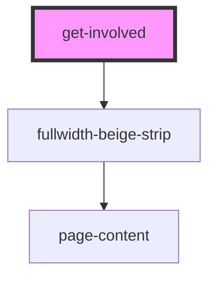

# get-involved

<!-- Auto Generated Below -->

## Properties

| Property   | Attribute  | Description | Type     | Default     |
| ---------- | ---------- | ----------- | -------- | ----------- |
| `typeform` | `typeform` |             | `string` | `undefined` |

## Dependencies

### Depends on

- [fullwidth-beige-strip](../../../containers/fullwidth-beige-strip)

### Graph

----------------------------------------------

*Built with [StencilJS](https://stenciljs.com/)*
