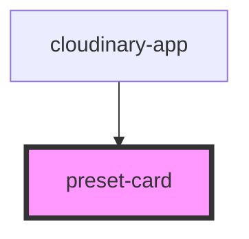

# preset-card

<!-- Auto Generated Below -->

## Properties

| Property     | Attribute    | Description | Type     | Default     |
| ------------ | ------------ | ----------- | -------- | ----------- |
| `dimensions` | `dimensions` |             | `string` | `undefined` |
| `presetid`   | `presetid`   |             | `string` | `undefined` |
| `presetname` | `presetname` |             | `string` | `undefined` |

## Events

| Event          | Description | Type               |
| -------------- | ----------- | ------------------ |
| `selectPreset` |             | `CustomEvent<any>` |

## Dependencies

### Used by

 - [cloudinary-app](..)

### Graph

----------------------------------------------

*Built with [StencilJS](https://stenciljs.com/)*
