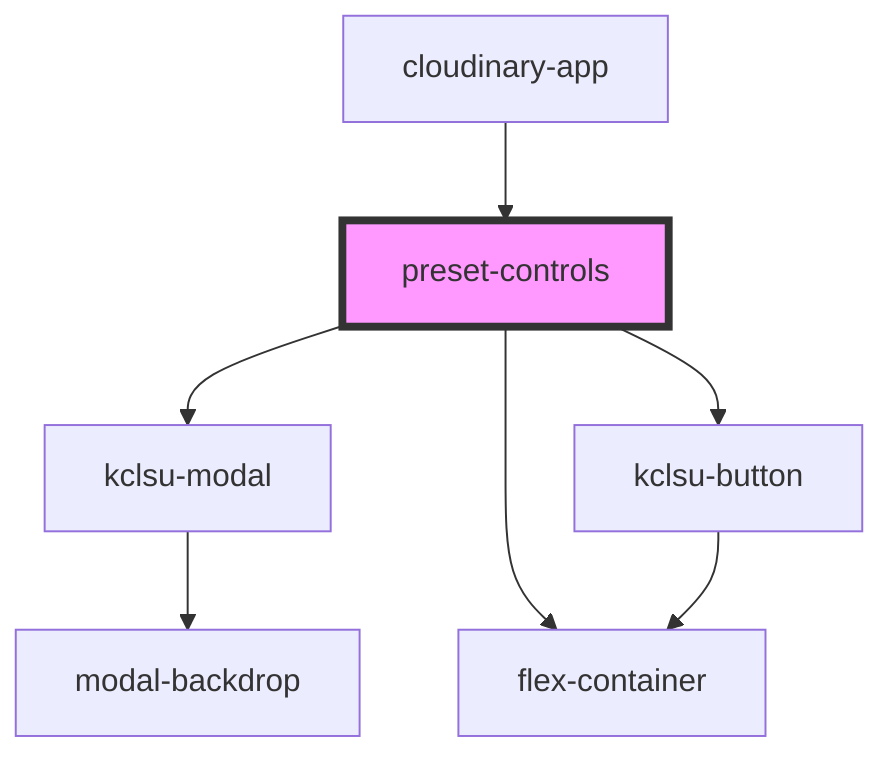

# preset-controls

<!-- Auto Generated Below -->

## Events

| Event         | Description | Type               |
| ------------- | ----------- | ------------------ |
| `submitEdits` |             | `CustomEvent<any>` |

## Dependencies

### Used by

 - [cloudinary-app](..)

### Depends on

- [kclsu-modal](../../../modal)
- [flex-container](../../../containers/flex-container)
- [kclsu-button](../../../buttons/kclsu-button)

### Graph

----------------------------------------------

*Built with [StencilJS](https://stenciljs.com/)*
