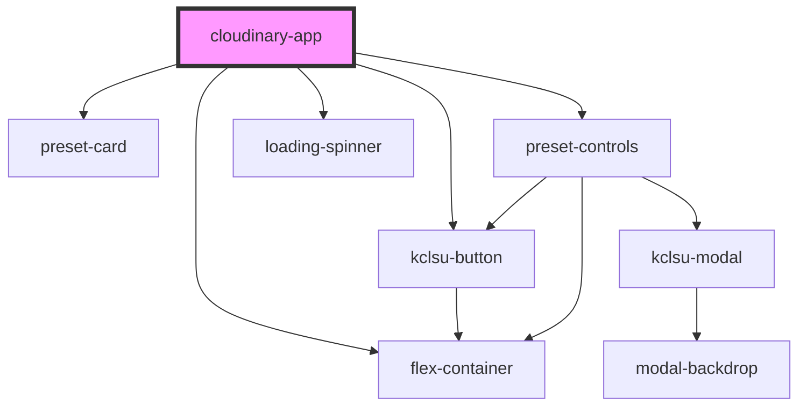

# cloudinary-app

<!-- Auto Generated Below -->

## Properties

| Property    | Attribute   | Description                                                                                                    | Type     | Default     |
| ----------- | ----------- | -------------------------------------------------------------------------------------------------------------- | -------- | ----------- |
| `public_id` | `public_id` | The Cloudinary image id - provided using the browser-side upload script, or using the the node server function | `string` | `undefined` |

## Dependencies

### Depends on

- [preset-card](preset-card)
- [flex-container](../../containers/flex-container)
- [kclsu-button](../../buttons/kclsu-button)
- [preset-controls](preset-controls)
- [loading-spinner](../../spinner)

### Graph

----------------------------------------------

*Built with [StencilJS](https://stenciljs.com/)*
