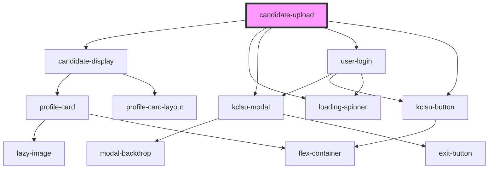

# candidate-upload

<!-- Auto Generated Below -->

## Properties

| Property          | Attribute         | Description                                                             | Type     | Default     |
| ----------------- | ----------------- | ----------------------------------------------------------------------- | -------- | ----------- |
| `electionid`      | `electionid`      | MSL ELections ID                                                        | `string` | `undefined` |
| `spreadsheetdata` | `spreadsheetdata` | The JSON generated from the browser-side uploaded excel spreadsheet     | `any`    | `undefined` |
| `stage`           | `stage`           | Either 'candidates' or 'results'. Will set the firebase url and key map | `string` | `'results'` |

## Dependencies

### Depends on

- [candidate-display](../elections-candidates/candidates-display)
- [loading-spinner](../../../spinner)
- [kclsu-modal](../../../modal)
- [user-login](../../../authentication/user-login)
- [kclsu-button](../../../buttons/kclsu-button)

### Graph

----------------------------------------------

*Built with [StencilJS](https://stenciljs.com/)*
