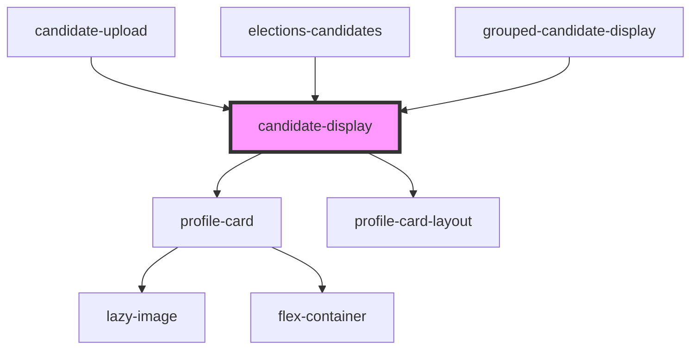

# candidate-display

<!-- Auto Generated Below -->

## Properties

| Property               | Attribute              | Description                                             | Type               | Default     |
| ---------------------- | ---------------------- | ------------------------------------------------------- | ------------------ | ----------- |
| `data`                 | `data`                 |                                                         | `any`              | `undefined` |
| `electionid`           | `electionid`           | URL for a page to hold breakdowns, as a fallback option | `number \| string` | `undefined` |
| `emitpostid`           | `emitpostid`           | URL for a page to hold breakdowns, as a fallback option | `boolean`          | `false`     |
| `fallbackbreakdownurl` | `fallbackbreakdownurl` | URL for a page to hold breakdowns, as a fallback option | `any`              | `undefined` |
| `legacy`               | `legacy`               | Using legacy data                                       | `boolean`          | `false`     |

## Dependencies

### Used by

 - [candidate-upload](../../candidate_upload)
 - [elections-candidates](..)
 - [grouped-candidate-display](../grouped-candidates-display)

### Depends on

- [profile-card](../../../../cards/profile-card)
- [profile-card-layout](../../../../containers/profile-card-layout)

### Graph

----------------------------------------------

*Built with [StencilJS](https://stenciljs.com/)*
