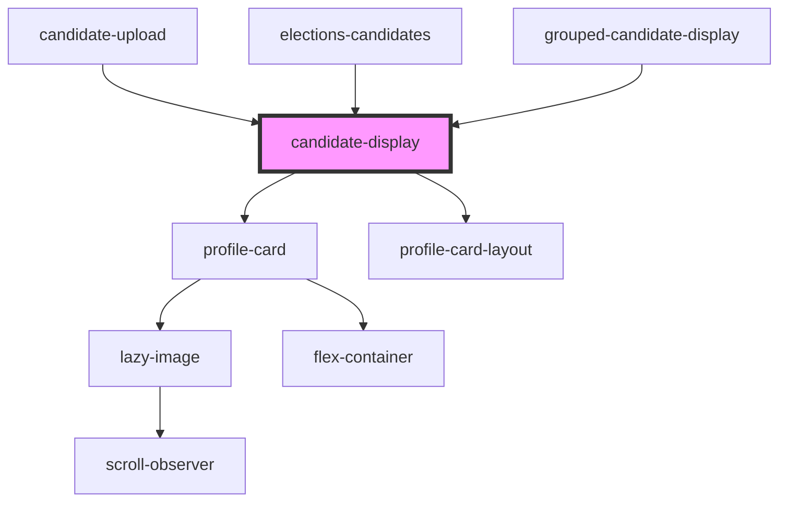

# candidate-display

<!-- Auto Generated Below -->

## Properties

| Property | Attribute | Description | Type  | Default     |
| -------- | --------- | ----------- | ----- | ----------- |
| `data`   | `data`    |             | `any` | `undefined` |

## Dependencies

### Used by

 - [candidate-upload](../../candidate_upload)
 - [elections-candidates](..)
 - [grouped-candidate-display](../grouped-candidates-display)

### Depends on

- [profile-card](../../../../cards/profile-card)
- [profile-card-layout](../../../../containers/profile-card-layout)

### Graph

----------------------------------------------

*Built with [StencilJS](https://stenciljs.com/)*
