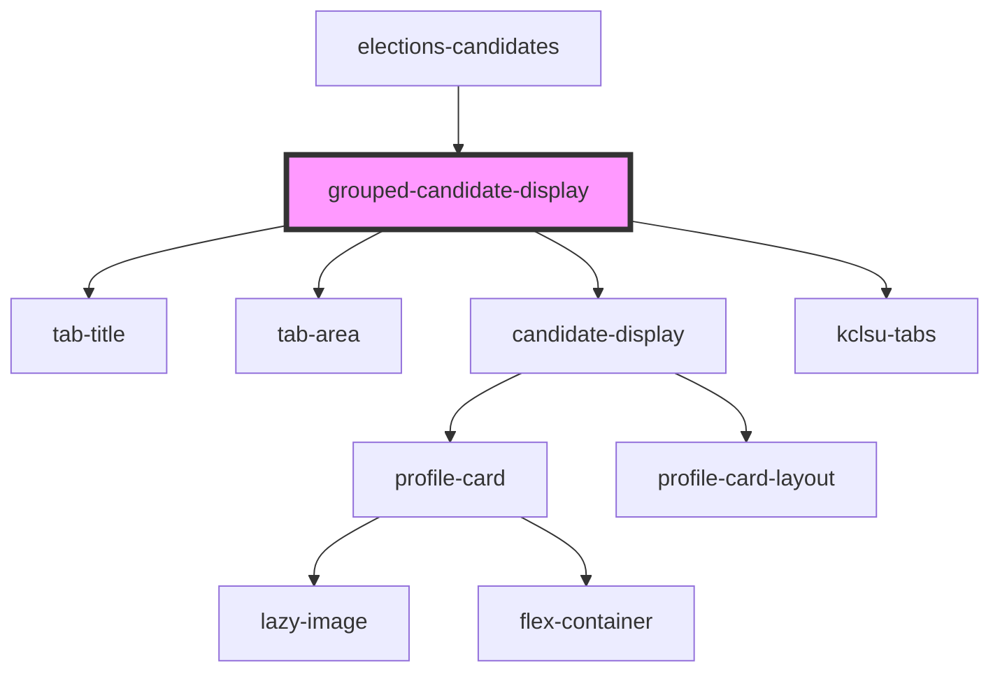

# academic-candidate-display

<!-- Auto Generated Below -->

## Properties

| Property               | Attribute              | Description                                             | Type      | Default     |
| ---------------------- | ---------------------- | ------------------------------------------------------- | --------- | ----------- |
| `data`                 | `data`                 |                                                         | `any`     | `undefined` |
| `electionid`           | `electionid`           | URL for a page to hold breakdowns, as a fallback option | `number`  | `undefined` |
| `emitpostid`           | `emitpostid`           | URL for a page to hold breakdowns, as a fallback option | `boolean` | `false`     |
| `fallbackbreakdownurl` | `fallbackbreakdownurl` | URL for a page to hold breakdowns, as a fallback option | `any`     | `undefined` |
| `legacy`               | `legacy`               | Using legacy data                                       | `boolean` | `false`     |

## Dependencies

### Used by

 - [elections-candidates](..)

### Depends on

- [tab-title](../../../../tabs/kclsu-tabs/tab-title)
- [tab-area](../../../../tabs/kclsu-tabs/tab-area)
- [candidate-display](../candidates-display)
- [kclsu-tabs](../../../../tabs/kclsu-tabs)

### Graph

----------------------------------------------

*Built with [StencilJS](https://stenciljs.com/)*
