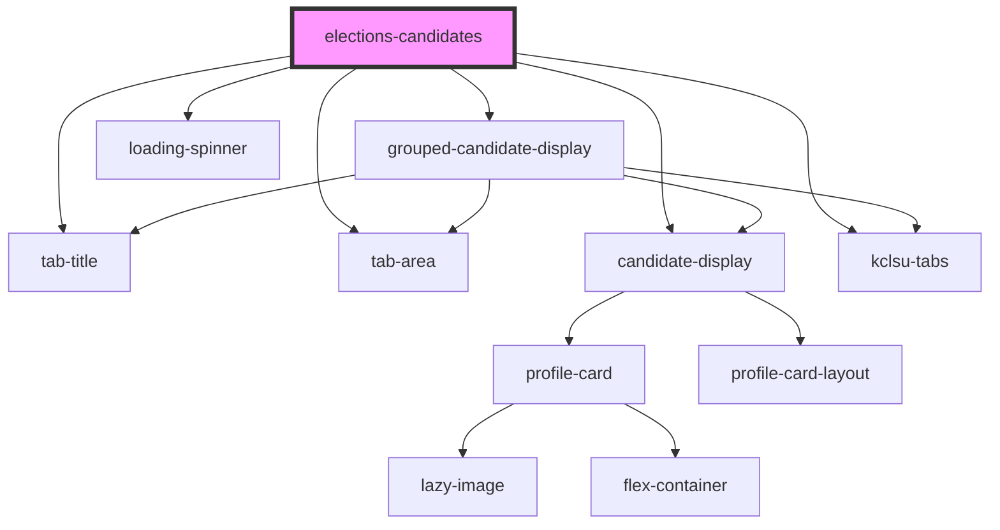

# elections-candidates

<!-- Auto Generated Below -->

## Properties

| Property     | Attribute    | Description                                                          | Type      | Default     |
| ------------ | ------------ | -------------------------------------------------------------------- | --------- | ----------- |
| `electionid` | `electionid` | The election ID from MSL!                                            | `string`  | `undefined` |
| `removeron`  | `removeron`  | Filter out RON profiles in the candidate listing                     | `boolean` | `false`     |
| `results`    | `results`    | Set to true to display results data. False to display All Candidates | `boolean` | `false`     |

## Dependencies

### Depends on

- [tab-title](../../../tabs/kclsu-tabs/tab-title)
- [tab-area](../../../tabs/kclsu-tabs/tab-area)
- [candidate-display](candidates-display)
- [kclsu-tabs](../../../tabs/kclsu-tabs)
- [grouped-candidate-display](grouped-candidates-display)
- [loading-spinner](../../../spinner)

### Graph

----------------------------------------------

*Built with [StencilJS](https://stenciljs.com/)*
