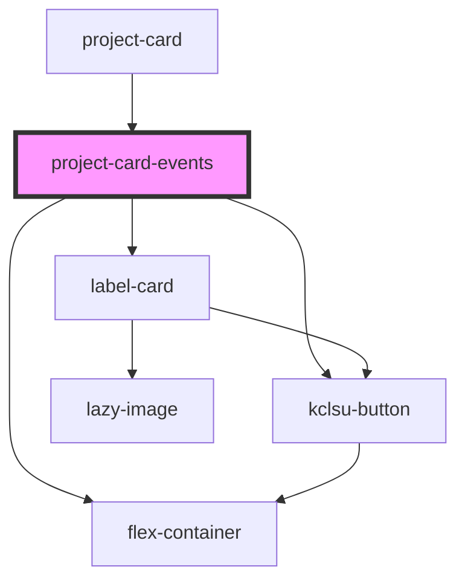

# project-card-events

<!-- Auto Generated Below -->

## Properties

| Property       | Attribute      | Description                                                                                                             | Type     | Default             |
| -------------- | -------------- | ----------------------------------------------------------------------------------------------------------------------- | -------- | ------------------- |
| `alleventsurl` | `alleventsurl` | Optional. Supply a URL which the All Events button will link to if there are events. Otherwise this is dynamically set. | `string` | `undefined`         |
| `heading`      | `heading`      | The main heading                                                                                                        | `string` | `"Upcoming Events"` |
| `tag`          | `tag`          | The MSL Event tag                                                                                                       | `string` | `undefined`         |

## Dependencies

### Used by

 - [project-card](..)

### Depends on

- [label-card](../../../../cards/label-card)
- [flex-container](../../../../containers/flex-container)
- [kclsu-button](../../../../buttons/kclsu-button)

### Graph

----------------------------------------------

*Built with [StencilJS](https://stenciljs.com/)*
